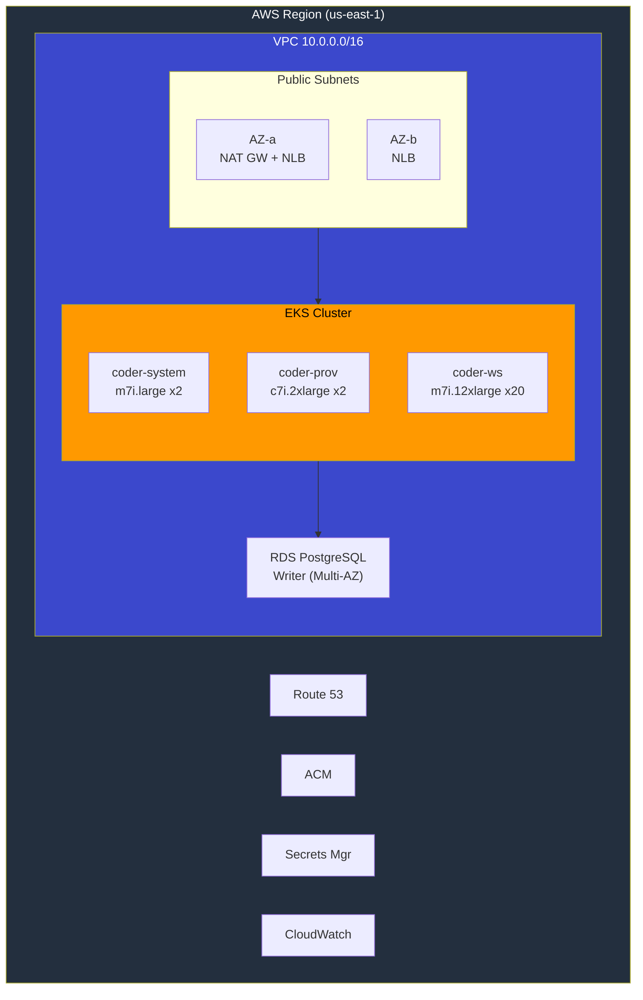
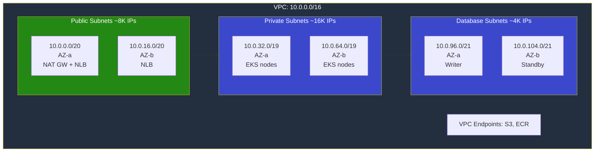
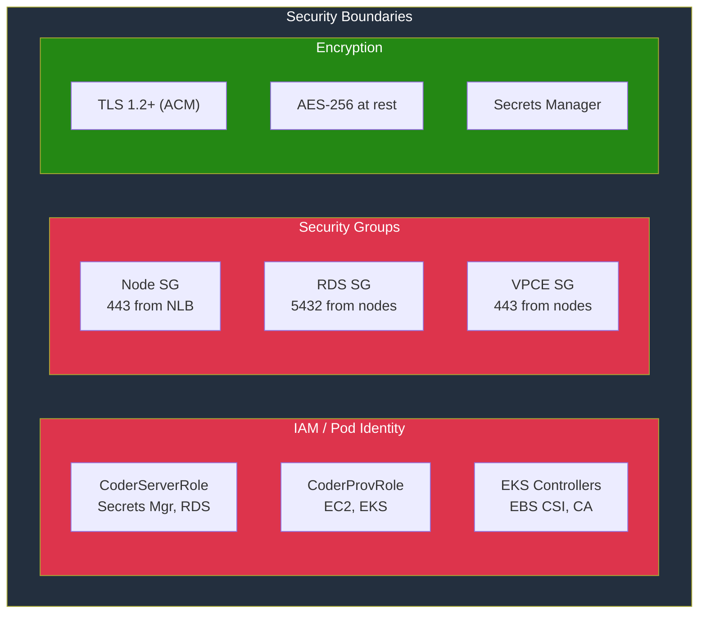
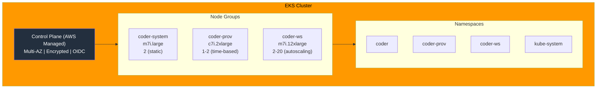
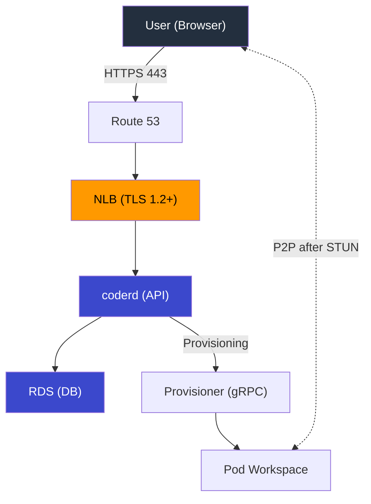
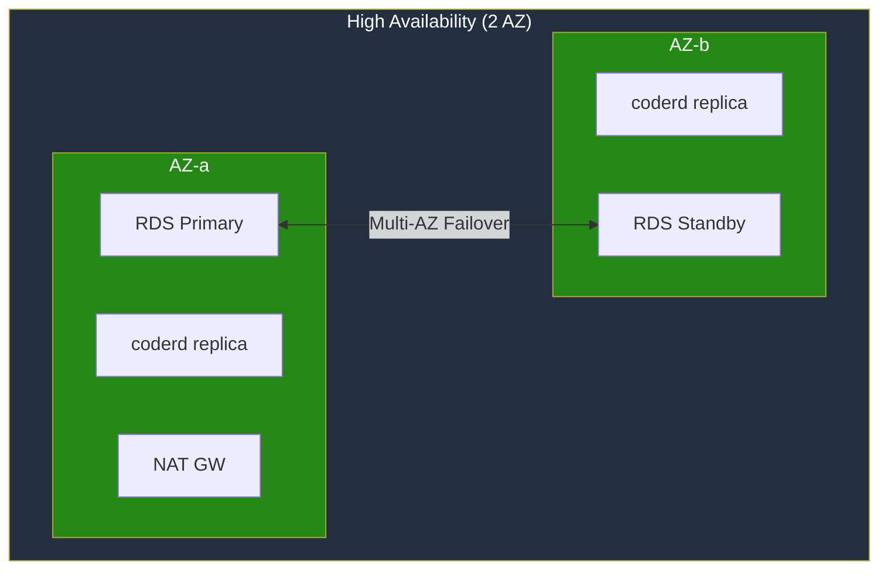

# Reference Architecture Diagrams

This document provides architectural diagrams for the Coder platform deployment on AWS EKS.

**Target:** 500 concurrent workspaces | 99.9% availability | AWS Well-Architected

---

## Table of Contents

1. [High-Level Architecture](#high-level-architecture)
2. [Network Architecture](#network-architecture)
3. [Security Architecture](#security-architecture)
4. [EKS Cluster Architecture](#eks-cluster-architecture)
5. [Data Flow Architecture](#data-flow-architecture)
6. [DR/HA Architecture](#drha-architecture)
7. [Upgrade Path](#upgrade-path)

---

## High-Level Architecture

```
┌────────────────────────────────────────────────────────────────────────────────┐
│                           AWS Region (us-east-1)                                │
│                                                                                 │
│  ┌───────────────────────────────────────────────────────────────────────────┐ │
│  │                           VPC (10.0.0.0/16)                                │ │
│  │                                                                            │ │
│  │   ┌────────────────────┐      ┌────────────────────┐                      │ │
│  │   │    Public AZ-a     │      │    Public AZ-b     │                      │ │
│  │   │    [NAT Gateway]   │      │                    │                      │ │
│  │   │    [NLB ENI]       │      │    [NLB ENI]       │                      │ │
│  │   └────────────────────┘      └────────────────────┘                      │ │
│  │                                                                            │ │
│  │   ┌─────────────────────────────────────────────────────────────────────┐ │ │
│  │   │                          EKS Cluster                                 │ │ │
│  │   │                                                                      │ │ │
│  │   │  ┌───────────────┐  ┌───────────────┐  ┌───────────────┐           │ │ │
│  │   │  │ coder-system  │  │  coder-prov   │  │   coder-ws    │           │ │ │
│  │   │  │   (coderd)    │  │ (provisioners)│  │ (workspaces)  │           │ │ │
│  │   │  │  m7i.large x2  │  │ c7i.2xlarge x2 │  │ m7i.12xlarge x20 │          │ │ │
│  │   │  └───────────────┘  └───────────────┘  └───────────────┘           │ │ │
│  │   │                                                                      │ │ │
│  │   └─────────────────────────────────────────────────────────────────────┘ │ │
│  │                                                                            │ │
│  │   ┌─────────────────────────────────────────────────────────────────────┐ │ │
│  │   │                 RDS PostgreSQL Multi-AZ                      │ │ │
│  │   │                      [Writer - Multi-AZ]                             │ │ │
│  │   └─────────────────────────────────────────────────────────────────────┘ │ │
│  │                                                                            │ │
│  └───────────────────────────────────────────────────────────────────────────┘ │
│                                                                                 │
│  ┌─────────────┐   ┌─────────────┐   ┌─────────────┐   ┌─────────────┐        │
│  │  Route 53   │   │    ACM      │   │  Secrets    │   │ CloudWatch  │        │
│  │   (DNS)     │   │  (Certs)    │   │  Manager    │   │  (Logs)     │        │
│  └─────────────┘   └─────────────┘   └─────────────┘   └─────────────┘        │
│                                                                                 │
└────────────────────────────────────────────────────────────────────────────────┘
```



### Key Components

| Component | AWS Service | Purpose |
|-----------|-------------|---------|
| Networking | VPC, 3 AZs, NAT GW | Network isolation |
| Compute | EKS with 3 node groups | Kubernetes workloads |
| Database | RDS PostgreSQL Multi-AZ (db.m7i.large) | Coder metadata |
| Load Balancing | Network Load Balancer | TLS termination, traffic distribution |
| DNS | Route 53 | Domain management |
| Certificates | ACM | TLS with auto-renewal |
| Secrets | Secrets Manager | Credentials storage |
| Monitoring | CloudWatch | Logs and basic metrics |

---

## Network Architecture

```
┌────────────────────────────────────────────────────────────────────────────────┐
│                              VPC: 10.0.0.0/16                                   │
│                                                                                 │
│  ┌───────────────────────────────────────────────────────────────────────────┐ │
│  │                       Public Subnets (NAT/NLB)                             │ │
│  │  ┌──────────────────────────┐  ┌──────────────────────────┐               │ │
│  │  │      10.0.0.0/20         │  │      10.0.16.0/20        │               │ │
│  │  │         AZ-a             │  │         AZ-b             │               │ │
│  │  │    NAT GW + NLB ENI      │  │       NLB ENI            │               │ │
│  │  └──────────────────────────┘  └──────────────────────────┘               │ │
│  └───────────────────────────────────────────────────────────────────────────┘ │
│                                                                                 │
│  ┌───────────────────────────────────────────────────────────────────────────┐ │
│  │                    Private Subnets (EKS Nodes)                             │ │
│  │  ┌──────────────────────────┐  ┌──────────────────────────┐               │ │
│  │  │      10.0.32.0/19        │  │      10.0.64.0/19        │               │ │
│  │  │         AZ-a             │  │         AZ-b             │               │ │
│  │  │  system + prov + ws      │  │  system + prov + ws      │               │ │
│  │  └──────────────────────────┘  └──────────────────────────┘               │ │
│  └───────────────────────────────────────────────────────────────────────────┘ │
│                                                                                 │
│  ┌───────────────────────────────────────────────────────────────────────────┐ │
│  │                      Database Subnets (RDS)                             │ │
│  │  ┌──────────────────────────┐  ┌──────────────────────────┐               │ │
│  │  │      10.0.96.0/21        │  │      10.0.104.0/21       │               │ │
│  │  │         AZ-a             │  │         AZ-b             │               │ │
│  │  │     RDS Primary          │  │    RDS Standby           │               │ │
│  │  └──────────────────────────┘  └──────────────────────────┘               │ │
│  └───────────────────────────────────────────────────────────────────────────┘ │
│                                                                                 │
│  VPC Endpoints: S3, ECR (Gateway + Interface)                                  │
└────────────────────────────────────────────────────────────────────────────────┘
```



### Subnet Allocation

| Subnet Type | CIDR Ranges | Purpose | IPs |
|-------------|-------------|---------|-----|
| Public | 10.0.0.0/20, 10.0.16.0/20 | NAT Gateway, NLB | ~8,000 |
| Private | 10.0.32.0/19, 10.0.64.0/19 | EKS node groups | ~16,000 |
| Database | 10.0.96.0/21, 10.0.104.0/21 | RDS PostgreSQL | ~4,000 |

---

## Security Architecture

```
┌────────────────────────────────────────────────────────────────────────────────┐
│                           Security Boundaries                                   │
│                                                                                 │
│  ┌───────────────────────────────────────────────────────────────────────────┐ │
│  │                         IAM / Pod Identity                                 │ │
│  │                                                                            │ │
│  │  ┌─────────────────┐  ┌─────────────────┐  ┌─────────────────┐           │ │
│  │  │ CoderServerRole │  │ CoderProvRole   │  │ EKS Controllers │           │ │
│  │  │ - Secrets Mgr   │  │ - EC2 (future)  │  │ - EBS CSI       │           │ │
│  │  │ - RDS connect   │  │ - EKS           │  │ - Cluster Auto  │           │ │
│  │  └─────────────────┘  └─────────────────┘  └─────────────────┘           │ │
│  └───────────────────────────────────────────────────────────────────────────┘ │
│                                                                                 │
│  ┌───────────────────────────────────────────────────────────────────────────┐ │
│  │                          Security Groups                                   │ │
│  │                                                                            │ │
│  │  ┌─────────────────┐  ┌─────────────────┐  ┌─────────────────┐           │ │
│  │  │    Node SG      │  │     RDS SG      │  │  VPC Endpoint   │           │ │
│  │  │ - 443 from NLB  │  │ - 5432 from     │  │       SG        │           │ │
│  │  │ - Inter-node    │  │   Node SG       │  │ - 443 from      │           │ │
│  │  │ - Egress: NAT   │  │                 │  │   Node SG       │           │ │
│  │  └─────────────────┘  └─────────────────┘  └─────────────────┘           │ │
│  └───────────────────────────────────────────────────────────────────────────┘ │
│                                                                                 │
│  ┌───────────────────────────────────────────────────────────────────────────┐ │
│  │                            Encryption                                      │ │
│  │                                                                            │ │
│  │  • TLS 1.2+ at NLB (ACM managed, auto-renewal)                            │ │
│  │  • AES-256 at rest (RDS, EBS via AWS managed keys)                     │ │
│  │  • Secrets Manager for DB credentials                                      │ │
│  └───────────────────────────────────────────────────────────────────────────┘ │
└────────────────────────────────────────────────────────────────────────────────┘
```



### Security Controls

| Control | Implementation |
|---------|----------------|
| TLS Termination | NLB with ACM certificates |
| TLS Version | TLS 1.2 minimum |
| Data at Rest | AES-256 (RDS, EBS) |
| IAM | Pod Identity for least-privilege |
| Network | Private subnets, VPC endpoints |
| Secrets | AWS Secrets Manager |
| Audit | CloudTrail, VPC Flow Logs |

---

## EKS Cluster Architecture

```
┌────────────────────────────────────────────────────────────────────────────────┐
│                              EKS Cluster                                        │
│                                                                                 │
│  ┌───────────────────────────────────────────────────────────────────────────┐ │
│  │                    Control Plane (AWS Managed)                             │ │
│  │                   Multi-AZ | Encrypted | OIDC                              │ │
│  └───────────────────────────────────────────────────────────────────────────┘ │
│                                                                                 │
│  ┌─────────────────────┐ ┌─────────────────────┐ ┌─────────────────────┐      │
│  │   coder-system      │ │    coder-prov       │ │     coder-ws        │      │
│  │                     │ │                     │ │                     │      │
│  │  m7i.large           │ │  c7i.2xlarge         │ │  m7i.12xlarge         │      │
│  │  Min: 2 / Max: 2    │ │  Min: 1 / Max: 2    │ │  Min: 2 / Max: 20   │      │
│  │  Scaling: Static    │ │  Scaling: Time-based│ │  Scaling: Time+CA   │      │
│  │                     │ │  (business hours)   │ │  (business hours)   │      │
│  │  Taint: system      │ │  Label: provisioner │ │  Label: workspace   │      │
│  └─────────────────────┘ └─────────────────────┘ └─────────────────────┘      │
│                                                                                 │
│  Namespaces:                                                                    │
│  ┌────────────┐  ┌────────────┐  ┌────────────┐  ┌────────────┐               │
│  │   coder    │  │ coder-prov │  │  coder-ws  │  │kube-system │               │
│  │  (coderd)  │  │(provisioner)│ │(workspaces)│  │(controllers)│              │
│  └────────────┘  └────────────┘  └────────────┘  └────────────┘               │
└────────────────────────────────────────────────────────────────────────────────┘
```



### Node Group Configuration

| Node Group | Instance | Min | Max | Scaling |
|------------|----------|-----|-----|---------|
| coder-system | m7i.large (2 vCPU, 8 GB) | 2 | 2 | Static |
| coder-prov | c7i.2xlarge (8 vCPU, 32 GB) | 1 | 2 | Time-based |
| coder-ws | m7i.12xlarge (48 vCPU, 192 GB) | 2 | 20 | Cluster Autoscaler |

### Scaling Schedule

- **Scale-up:** 06:45 ET (ready before 07:00 work start)
- **Scale-down:** 18:15 ET (after 18:00 work end)
- **Weekends:** Scale to minimum

---

## Data Flow Architecture

```
┌────────────────────────────────────────────────────────────────────────────────┐
│                           User Request Flow                                     │
│                                                                                 │
│  ┌──────────┐                                                                   │
│  │   User   │                                                                   │
│  │(Browser) │                                                                   │
│  └────┬─────┘                                                                   │
│       │ HTTPS (443)                                                             │
│       ▼                                                                         │
│  ┌──────────┐     ┌──────────┐     ┌──────────┐     ┌──────────┐              │
│  │ Route 53 │────▶│   NLB    │────▶│  coderd  │────▶│   RDS    │              │
│  │          │     │(TLS 1.2+)│     │  (API)   │     │   (DB)   │              │
│  └──────────┘     └──────────┘     └────┬─────┘     └──────────┘              │
│                                         │                                       │
│                                         │ Workspace Provisioning                │
│                                         ▼                                       │
│                                    ┌──────────┐                                 │
│                                    │Provisioner│                                │
│                                    │  (gRPC)   │                                │
│                                    └────┬─────┘                                 │
│                                         │                                       │
│                                         ▼                                       │
│                                    ┌──────────┐                                 │
│                                    │  Pod WS  │                                 │
│                                    │(K8s Pod) │                                 │
│                                    └──────────┘                                 │
│                                                                                 │
│  Workspace Connectivity:                                                        │
│  ┌────────────────────────────────────────────────────────────────────────────┐│
│  │ 1. Client → NLB → coderd/DERP relay → K8s Service → Pod workspace          ││
│  │ 2. Client ←──── P2P (UDP, after STUN) ────→ Pod workspace                  ││
│  └────────────────────────────────────────────────────────────────────────────┘│
└────────────────────────────────────────────────────────────────────────────────┘
```



---

## DR/HA Architecture

```
┌────────────────────────────────────────────────────────────────────────────────┐
│                         High Availability Design                                │
│                                                                                 │
│  ┌───────────────────────────────────────────────────────────────────────────┐ │
│  │                        Multi-AZ Deployment                                 │ │
│  │                                                                            │ │
│  │       AZ-a                              AZ-b                               │ │
│  │  ┌─────────────┐                   ┌─────────────┐                        │ │
│  │  │   coderd    │                   │   coderd    │                        │ │
│  │  │  replica 1  │                   │  replica 2  │                        │ │
│  │  └─────────────┘                   └─────────────┘                        │ │
│  │  ┌─────────────┐                   ┌─────────────┐                        │ │
│  │  │    RDS      │◄─── Multi-AZ ────▶│    RDS      │                        │ │
│  │  │   Writer    │    Failover       │  (standby)  │                        │ │
│  │  └─────────────┘                   └─────────────┘                        │ │
│  │  ┌─────────────┐                                                          │ │
│  │  │   NAT GW    │  (single NAT - acceptable for MVP)                       │ │
│  │  └─────────────┘                                                          │ │
│  └───────────────────────────────────────────────────────────────────────────┘ │
│                                                                                 │
│  Recovery Objectives:                                                           │
│  ┌───────────────────────────────────────────────────────────────────────────┐ │
│  │  RTO: 2 hours     |  RPO: 15 minutes  |  Availability: 99.9%              │ │
│  └───────────────────────────────────────────────────────────────────────────┘ │
│                                                                                 │
│  Backup Strategy:                                                               │
│  ┌───────────────────────────────────────────────────────────────────────────┐ │
│  │  • RDS automated backups (point-in-time recovery)                       │ │
│  │  • 7-day backup retention (increase to 90 days for production)            │ │
│  │  • Monthly backup restore testing                                          │ │
│  └───────────────────────────────────────────────────────────────────────────┘ │
│                                                                                 │
│  Failover:                                                                      │
│  ┌───────────────────────────────────────────────────────────────────────────┐ │
│  │  • AZ failure: Service continues via remaining AZ                          │ │
│  │  • RDS failover: Automatic promotion (~30s)                             │ │
│  │  • Node failure: K8s reschedules pods                                      │ │
│  └───────────────────────────────────────────────────────────────────────────┘ │
└────────────────────────────────────────────────────────────────────────────────┘
```



### Recovery Objectives

| Metric | Target |
|--------|--------|
| RTO | 2 hours |
| RPO | 15 minutes |
| Availability | 99.9% |

---

## Upgrade Path

Future enhancements from MVP to full architecture:

| Phase | Addition | Trigger |
|-------|----------|---------|
| v1.1 | 3rd AZ + 2 more NAT GWs | >99.95% SLA requirement |
| v1.1 | RDS read replicas | Read latency issues |
| v1.2 | EC2 Linux templates | Windows/GPU needs |
| v1.2 | Spot instances | Cost optimization |
| v2.0 | Cross-region DR | Compliance/DR requirements |
| v2.0 | Additional VPC endpoints | Security hardening |

### Workspace Sizes (MVP)

| Size | vCPU | RAM | Storage | Distribution |
|------|------|-----|---------|--------------|
| S | 2 | 4 GB | 20 GB | 25% |
| M | 4 | 8 GB | 50 GB | 60% |
| L | 16 | 32 GB | 100 GB | 15% |

These estimates drive node pool sizing for 500 peak concurrent workspaces.

---

*Document Version: 1.0 (MVP)*  
*Last Updated: December 2025*
